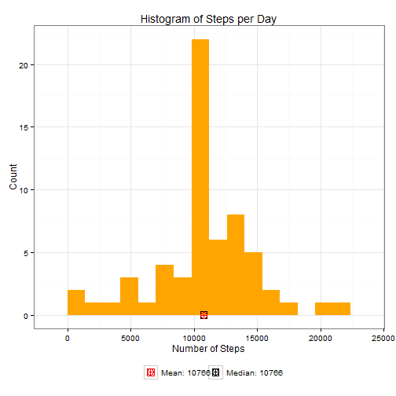
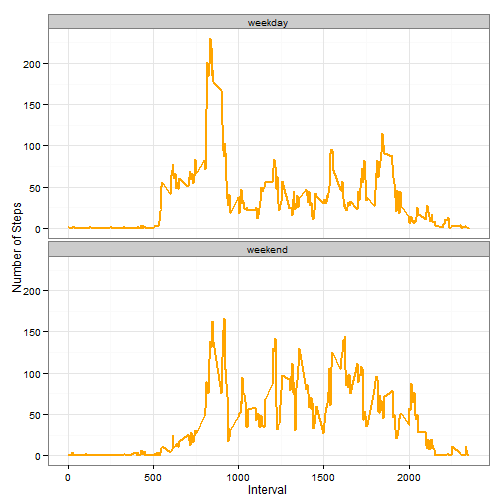

# Reproducible Research : Peer Assessment 1
========================================================

It is now possible to collect a large amount of data about personal movement using activity monitoring devices such as a [Fitbit][1], [Nike Fuelband][2], or [Jawbone Up][3]. These type of devices are part of the “quantified self” movement – a group of enthusiasts who take measurements about themselves regularly to improve their health, to find patterns in their behavior, or because they are tech geeks. But these data remain under-utilized both because the raw data are hard to obtain and there is a lack of statistical methods and software for processing and interpreting the data.

##Assigment
This assignment makes use of data from a personal activity monitoring device. This device collects data at 5 minute intervals through out the day. The data consists of two months of data from an anonymous individual collected during the months of October and November, 2012 and include the number of steps taken in 5 minute intervals each day.

## Loading and preprocessing the data
* Loading the data

```r
library(RCurl)  #if the data source does not exists we need to download from the repository.
```

```
## Loading required package: bitops
```

```r
library(ggplot2)  #ggplot2 is used for plotting  
file_name = "activity.csv"
setInternet2(use = TRUE)  #required to support SSL in the url
url_source = "https://raw.githubusercontent.com/juancarlosgarcia/RepData_PeerAssessment1/master/activity.csv"
if (!file.exists(file_name)) {
    download.file(url_source, destfile = file_name, method = "auto")
}

## A new class is required to handle the date format.
setClass("myDate")
setAs("character", "myDate", function(from) as.Date(from, format = "%Y-%m-%d"))

activity_data <- read.csv(file_name, colClasses = c("numeric", "myDate", "numeric"), 
    header = T)
```

* Transform the data into an aggregate format suitable for the analysis

```r
calc_interval_activity <- function(activity_ds) {
    activity_inv <- aggregate(activity_ds$steps, by = list(interval = activity_ds$interval), 
        FUN = mean, na.rm = T)
    
    colnames(activity_inv) <- c("interval", "steps")
    
    activity_inv
}
```


## What is mean total number of steps taken per day?
* This is a histogram of the total number of steps taken each day


```r
plot_histogram <- function(activity_day, steps_mean, steps_median) {
    .e = environment()
    point_labels = c(paste(" Mean:", steps_mean), paste(" Median:", steps_median))
    point_color_1 = "red"
    point_color_2 = "black"
    color_list = c(point_color_1, point_color_2)
    
    ggplot(activity_day, aes(x = steps), environment = .e) + geom_histogram(fill = "orange", 
        binwidth = 1400) + geom_point(aes(x = steps_mean, y = 0, color = point_color_1), 
        size = 4, shape = 12) + geom_point(aes(x = steps_median, y = 0, color = point_color_2), 
        size = 4, shape = 10) + scale_color_manual(name = element_blank(), labels = point_labels, 
        values = color_list) + labs(title = "Histogram of Steps per Day", x = "Number of Steps", 
        y = "Count") + theme_bw() + theme(legend.position = "bottom")
}

activity_day <- aggregate(steps ~ date, data = activity_data, FUN = sum)
steps_mean <- round(mean(activity_day$steps), 0)
steps_median <- round(median(activity_day$steps), 0)

plot_histogram(activity_day, steps_mean, steps_median)
```

 

* The mean and median total number of steps taken per day are :
 - **Mean: 10766**
 - **Median: 10765**

## What is the average daily activity pattern?
This is a time series plot (i.e. type = "l") of the 5-minute interval (x-axis) and the average number of steps taken, averaged across all days (y-axis)


```r
activity_inv <- calc_interval_activity(activity_data)
steps_max <- which.max(activity_inv$steps)
interval_max <- activity_inv[steps_max, ]$interval
point_labels <- c(paste(" Maximun Activity Interval:", interval_max))
ggplot(activity_inv, aes(x = interval, y = steps)) + geom_line(color = "orange", 
    size = 1) + geom_point(aes(x = interval_max, y = 0, color = "red"), size = 4, 
    shape = 12) + scale_color_manual(name = element_blank(), labels = point_labels, 
    values = c("red")) + labs(title = "Average daily activity pattern", x = "5-minute Interval", 
    y = "Average Steps") + theme_bw() + theme(legend.position = "bottom")
```

 

* The 5-minute interval, on average across all the days in the dataset, contains the maximum number of steps is :
 - **5-minute interval: 835**

## Imputing missing values
There are a number of days/intervals where there are missing values (coded as NA). The presence of missing days may introduce bias into some calculations or summaries of the data.


```r
indices_na <- which(is.na(activity_data$steps))

replace_na <- unlist(lapply(indices_na, FUN = function(index) {
    interval = activity_data[index, ]$interval
    activity_inv[activity_inv$interval == interval, ]$steps
}))

activity_imputed <- data.frame(steps = activity_data$steps, date = activity_data$date, 
    interval = activity_data$interval)
activity_imputed$steps[indices_na] <- replace_na
```

* The summary of the new dataset with imputed values is :

```r
summary(activity_imputed)
```

```
##      steps            date               interval   
##  Min.   :  0.0   Min.   :2012-10-01   Min.   :   0  
##  1st Qu.:  0.0   1st Qu.:2012-10-16   1st Qu.: 589  
##  Median :  0.0   Median :2012-10-31   Median :1178  
##  Mean   : 37.4   Mean   :2012-10-31   Mean   :1178  
##  3rd Qu.: 27.0   3rd Qu.:2012-11-15   3rd Qu.:1766  
##  Max.   :806.0   Max.   :2012-11-30   Max.   :2355
```

* This is the histogram based on the imputed dataset

```r
activity_imputed_day <- aggregate(steps ~ date, data = activity_imputed, FUN = sum)
steps_imputed_mean <- round(mean(activity_imputed_day$steps), 0)
steps_imputed_median <- round(median(activity_imputed_day$steps), 0)

plot_histogram(activity_imputed_day, steps_imputed_mean, steps_imputed_median)
```

 

* Comparing with the metrics with the original activity dataset in the first section of this document, we observe that while the mean value remains the same, the median value has shifted closer to the mean.

* The mean and median total number of steps taken per day are :
 - **Mean: 10766**
 - **Median: 10766**

## Are there differences in activity patterns between weekdays and weekends?
* The comparison plot is based on the filled-in missing values.

1. Calculate the day of the week
2. Subset the table into two parts - weekends (Saturday and Sunday) and weekdays (Monday through Friday).
3. Aggregate the average steps per interval for each dataset.
4. Plot the two datasets side by side.


```r
calc_week_activity <- function(activity_ds) {
    activity_ds$weekday <- as.factor(weekdays(activity_ds$date))
    
    wkend_data <- subset(activity_ds, weekday %in% c("Saturday", "Sunday"))
    wkday_data <- subset(activity_ds, !weekday %in% c("Saturday", "Sunday"))
    
    
    wkend_interval <- calc_interval_activity(wkend_data)
    wkday_interval <- calc_interval_activity(wkday_data)
    
    
    wkend_interval$daytype <- rep("weekend", nrow(wkend_interval))
    wkday_interval$daytype <- rep("weekday", nrow(wkday_interval))
    
    activity_week <- rbind(wkend_interval, wkday_interval)
    activity_week
}

activity_week <- calc_week_activity(activity_imputed)

ggplot(activity_week, aes(x = interval, y = steps)) + geom_line(color = "orange", 
    size = 1) + facet_wrap(~daytype, nrow = 2, ncol = 1) + labs(x = "Interval", 
    y = "Number of Steps") + theme_bw()
```

 


* We observe that : 
  - The activity on the weekends is constant over the day compared to the weekdays that is more activity in the morning.
  - This could be due to the fact that activities on weekdays mostly follow a work related routine, whereas weekends anytime is good for the activity.


[1]:http://www.fitbit.com/ec
[2]:http://www.nike.com/us/en_us/c/nikeplus-fuelband
[3]:https://jawbone.com/up
